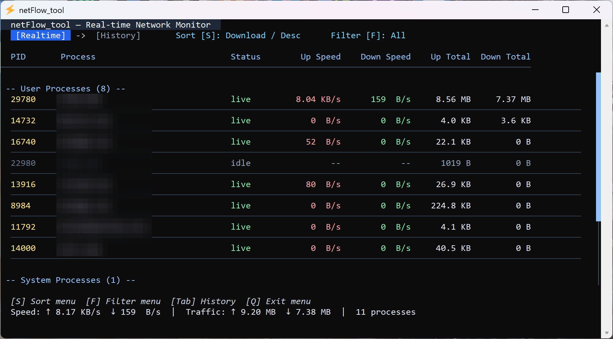
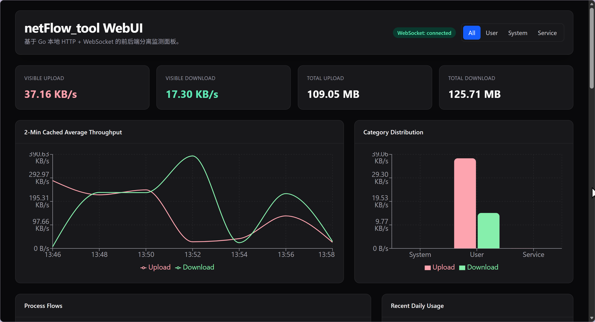

# netFlow_tool

`netFlow_tool` 是一个 （~~青春版netlimiter~~） Windows 的终端网络流量监控工具，采用Rust和Go编写 ：

- **Rust core** WinDivert 抓包、协议解析、PID 映射、流量聚合与 IPC 传输
- **Go UI** 拉起核心进程、轮询统计快照，终端实时展示进程上传/下载信息

## TUI



## Web-ui



## 功能概览

- 按进程展示实时上传 / 下载速率
- 展示累计上传 / 下载流量
- 可以按 `User / System / Service` 分类查看进程
- 提供历史流量统计页面
- 提供本地 WebUI 实时监测面板
- 提供终端内排序、筛选、退出 / 重启菜单

## 使用说明

### 实时页面

- `S`：打开排序菜单
- `F`：打开筛选菜单
- `Tab`：切换到历史页面
- 鼠标滚轮：上下滚动
- 拖动右侧滚动条：滚动列表

### 历史页面

- `T`：按总流量降序排序
- `D`：按日期降序排序
- `Tab`：切回实时页面

### 退出菜单

- `Q`：呼出退出菜单
- `Up / Down`：选择 `Quit` 或 `Restart`
- `Enter`：确认执行
- `Esc`：返回上一层

## 项目结构

```text
netFlow_tool/
├─ rust_core/                # Rust 抓包与聚合核心
│  ├─ src/
│  └─ libs/                  # WinDivert 运行时与导入库
├─ go-ui/                    # Go Bubble Tea 终端 UI
├─ scripts/                  # 本地构建 / 运行脚本
├─ build/                    # 本地产物输出目录（生成物）
└─ .github/workflows/        # GitHub Actions 工作流
```

## 运行环境

- Windows 10/11
- 管理员权限运行
- Rust MSVC toolchain
- Go 1.21+

> 管理员权限仅用于 **WinDivert 驱动抓包与监测**，不会涉及其他额外的系统级用途。

## WinDivert 文件说明

仓库现已包含项目运行与构建所需的 WinDivert 文件，位于 `rust_core/libs/`：

- `WinDivert.dll`
- `WinDivert64.sys`
- `WinDivert.lib`

其中：

- `WinDivert.dll`：运行时动态库
- `WinDivert64.sys`：内核驱动
- `WinDivert.lib`：Rust 构建时使用的导入库

如果你准备替换 WinDivert 版本，请确保这三个文件保持版本匹配。

## 快速开始

在仓库根目录的 PowerShell 中执行：

```powershell
# 构建 Rust core + Go UI，并将最终产物复制到 build/
.\scripts\build.ps1

# 运行终端 UI（UI 会自动拉起并管理 Rust core）
.\scripts\run.ps1
```

首次真正抓包时，需要以管理员权限运行。

启动后，Go 进程会额外拉起一个本地 Web UI 服务，并随机监听一个高位端口，例如：

```text
Web UI: http://127.0.0.1:52341
```

程序会尝试自动打开浏览器。即使浏览器没有自动弹出，也可以手动访问终端中输出的地址。

## WebUI 架构

WebUI 采用前后端分离：

- **后端**：Go 本地 HTTP server
  - 提供 `/api/bootstrap` 初始化接口
  - 提供 `/ws` WebSocket 实时推送接口
- **前端**：使用 Vite 构建的独立 React 工程
  - 使用 React 渲染
  - 使用 Tailwind CSS 做样式
  - 使用本地 shadcn 风格组件组织界面
  - 使用 TanStack Table 渲染表格
  - 使用 Recharts 绘制实时图表

前端源码位于 `go-ui/web/webui/`，构建产物输出到 `go-ui/web/webui/dist/`，随后由 Go 程序直接嵌入并服务。

## 手动构建

### 构建 Rust core

```powershell
cd rust_core
$env:WINDIVERT_PATH = (Resolve-Path ".\libs").Path
cargo build --release
```

### 构建 Go UI

```powershell
cd go-ui
go build -o ..\build\netFlow_tool-ui.exe .
```

## 输出产物

执行 `.\scripts\build.ps1` 后，`build\` 目录下会生成：

- `netFlow_tool-core.exe`
- `netFlow_tool-ui.exe`
- `WinDivert.dll`
- `WinDivert64.sys`

> 双击`netFlow_tool-ui.exe`即可运行并自动拉取`netFlow_tool-core.exe`

## 运行机制

### 数据流

```text
Network
  -> WinDivert
  -> crossbeam channel
  -> parser
  -> PID mapper
  -> FlowAggregator
  -> IPC pipe server
  -> Go StatsService
  -> Bubble Tea UI
```

### 核心设计

- Rust 抓包线程使用非阻塞 `try_send()`，避免卡住 WinDivert 队列
- 主线程批量消费数据包，降低频繁同步开销
- PID 映射器缓存系统连接表，提高 PID 查询效率
- `FlowAggregator` 不主动删除条目，避免 UI 刷新时闪烁
- Go UI 通过后台服务轮询快照，渲染线程只读缓存

## 常用开发命令

### Rust

```powershell
cd rust_core
cargo fmt
cargo clippy -- -D warnings
```

### Go

```powershell
cd go-ui
gofmt -w .
go test ./...
```

## 故障排查

### 提示需要管理员权限

这是因为 WinDivert 抓包需要管理员权限。UI 已提供自动提权重启能力，可以按 `Q` 打开退出菜单后选择重启，或直接重新以管理员身份运行程序。

### 看不到流量数据

请检查：

- 是否使用管理员权限启动
- `build\` 目录中是否包含 `WinDivert.dll` 与 `WinDivert64.sys`
- Rust core 是否已成功启动

### 构建失败

请检查：

- 是否安装 Rust MSVC 工具链
- 是否安装 Go 1.21+
- `rust_core/libs/` 中的 WinDivert 文件是否完整

## 已知限制

- 当前以监控展示为主，限速逻辑尚未接入主流程
- 同一时刻仅支持单个 UI 客户端连接 IPC
- Windows 终端字体差异可能影响少量字符显示效果

## 许可证与第三方组件

- 本项目采用 `MIT License`
- 项目依赖 WinDivert，请在发布和再分发时确认对应版本的许可证条款
- WinDivert 官方项目：<https://github.com/basil00/WinDivert>
